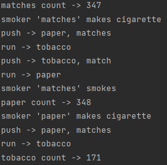

# Exercise five

## Task 1 / the problem of smokers
### Description 
According to the lecture, implement a solution to the problem of smokers. In the case of a modification 
in which the agent is not waiting for signaling of resource allocation, solve the problem of 
favoring smokers and describe this solution in the documentation in an appropriate manner.
### Solution 
#### Code
In my solution is used pushers. Every pusher wait for agent who signalize that material can
be pushed on table. If on table is another material, not pushed from pusher, pusher signalize 
for smoker,he can run. It is implemented here:

>       shared.matches.wait()
>           shared.mutex.lock()
>           if shared.isTobacco:
>               shared.isTobacco -= 1
>               shared.pusherPaper.signal()
>           elif shared.isPaper:
>               shared.isPaper -= 1
>               shared.pusherTobacco.signal()
>           else:
>               shared.isMatches += 1
>           shared.mutex.unlock()

This is example for matches pusher. Same for another pushers. 
When on table is not material from another pushers, pusher push own material.
Everything run in never ending loop.

#### The problem of favoring smokers
In shared object are added counters for solution this problem. Every counter up when smoker 
smoked cigarette. 

>       self.tobaccoCounter = 0
>       self.matchesCounter = 0
>       self.paperCounter = 0

Counting is implementing in smoker.

>       sleep(randint(0, 10) / 100)
>       # smoker wait for dealer put tobacco and paper
>       shared.pusherMatches.wait()
>       # up counter when smoker smoke
>       shared.matchesCounter += 1
>       # print actual number of smoker calls
>       print(f"matches count -> {shared.matchesCounter}")
>       make_cigarette("matches")
>       smoke("matches")

##### Conclusion
Is no problem that one smoker is still signalized first. Real problem is that one is called
still second. Then he is called half times less.

In my solution to the problem, the call of smokers alternates evenly so that each one is first and once a second. This 
solution proves to be sufficient to solve the problem.

## Task 2 / the problem of savages
### Description
Develop a program that solves the modified synchronization problem of throwing savages (Dinning Savages).
There are several chefs in the tribe. When the savage finds out that the pot is empty, he wakes up ALL the chefs who can help each other cook and cook together. ONLY ONE chef will tell the waiting savage that he is cooked.
The chef puts portions into the pot, not savages!

### Solution
I use code from lecture, remake some functions and add this in solution 

#### First step
Set semaphore signal for all cookers
>       117    print(f"divoch {sid}: budim kuchara")
>       118    # signal for all cookers
>       119    shared.emptyPot.signal(cooker_number)
>       220    shared.fullPot.wait()

#### Second step
Add barrier for waiting for all cookers and do code one by one
>       89    shared.cooker_wait.wait(last="\n")

#### Thirty step
Add counter in shared and increment it after every thread of cooker.
If is last cooker, signalize full pot for savage and reset cooker counter

>       92    shared.cookers += 1
>       93    if shared.cookers == cooker_number:
>       94        putServingsInPot(shared)
>       95        # signal for savages
>       96        shared.fullPot.signal()
>       97        shared.cookers = 0